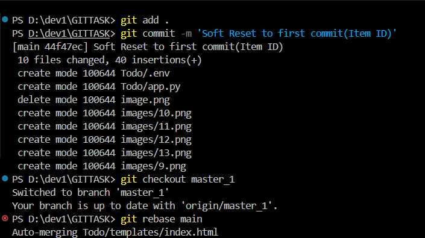

# GIT ASSIGNMENT

## Q1 - Create a new GitHub repository.

### Clone the repository to your local machine using SSH (generate an SSH key if needed, add the public key to your GitHub account).

### Create a new branch named after your username (e.g., Tutedude).

### Add your Flask project files to this branch.

### Commit the changes and merge the branch into the main branch.

## 2. Create a new branch named <your_name>_new (e.g., Tutedude_new).

### Update the content of the JSON file used for the /api route in this branch.
### Merge the <your_name>_new branch into the main branch.
### If there are conflicts during the merge, resolve them by accepting the changes from the <your_name>_new branch.
### Add the resolved changes to the staging area, commit them, and push the updates to the remote repository.   

## 3. Branch Creation:
### Create two branches: master_1 and master_2 from the main branch.
### Feature Development in master_1:
### In the master_1 branch, create a To-Do Page in the frontend.
### The page should contain a form with the following fields:
### Item Name
### Item Description

### Backend API in master_2:
### In the master_2 branch, create a backend route named /submittodoitem.
### This route will:
### Accept itemName and itemDescription via a POST request.
### Store these details in a MongoDB database.

### Merging Changes:
### Merge the changes from both master_1 and master_2 into the main branch.

## 4. Enhancing the To-Do Form in master_1:
### In the master_1 branch, add the following fields to the To-Do form:
### Item ID
### Item UUID
### Item Hash
### Committing in Sequence:
#### Add and commit each field separately in the following order:
#### First commit: Add Item ID field.
#### Second commit: Add Item UUID field.
#### Third commit: Add Item Hash field.

### Merging to main:
### Merge the master_1 branch into the main branch.
### Git Reset and Commit Deletion:
### In the main branch, use Git Reset to roll back to the commit where only the Item ID field was added.
### Use git reset --soft to ensure changes remain staged.
### Re-commit this state to the main branch.
### Merge this updated state to the main branch.
### Rebasing Changes:
### Rebase the updated changes in the main branch to the master_1 branch.
### Clarification:
### During rebasing, preserve individual commits to maintain the commit history for each change (i.e., do not squash commits).
### Use git rebase main master_1 to integrate changes from the main branch back into the master_1 branch.

## Author : Shantum Sharma
